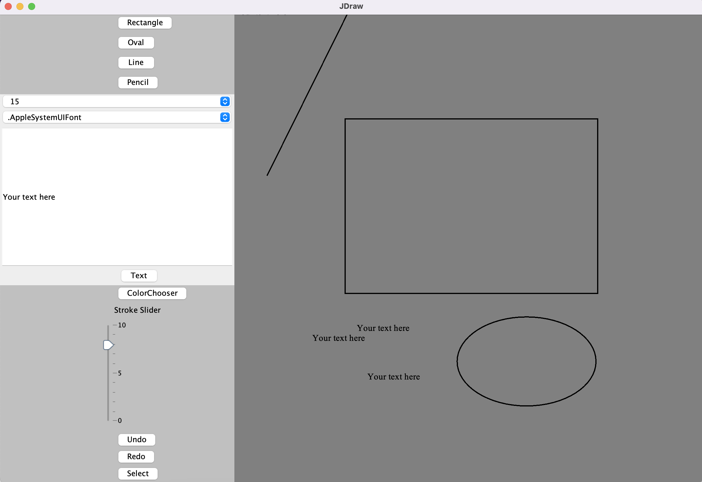

## Java drawing app based on Swing

 


### how to run this project:

```sh
$ cd JDraw
$ gradle run
```

note: you might need to have gradle installed first to run this project, after install, use `gradle --version` to check.


### Features (and todos)

- [x] Draw shapes (include Rectangle, Oval, Line)
- [x] Pencil
- [x] Add text
- [x] Change color of next object to be added
- [ ] Eraser
- [x] Change stroke (thickness) of next object to be added
- [ ] open image
- [ ] save image
- [x] undo / redo add objects
- [x] move selected object
- [ ] Update color & stroke in sidebar when selecting new object
- [ ] undo / redo move
- [ ] undo / redo change color & stroke
- [ ] zoom in / out
- [ ] Fill color
- [ ] UI re-design (replace buttons with icons)

