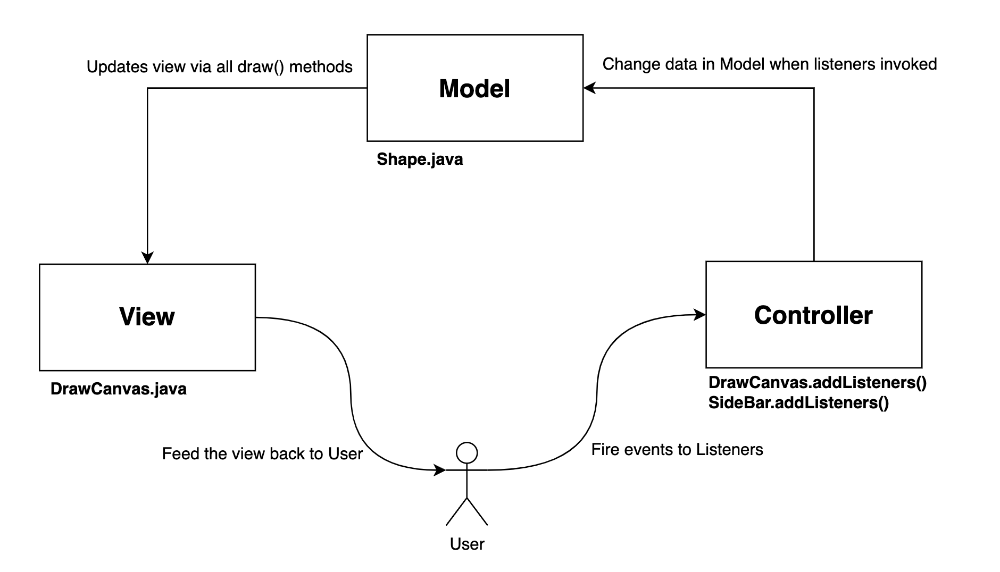
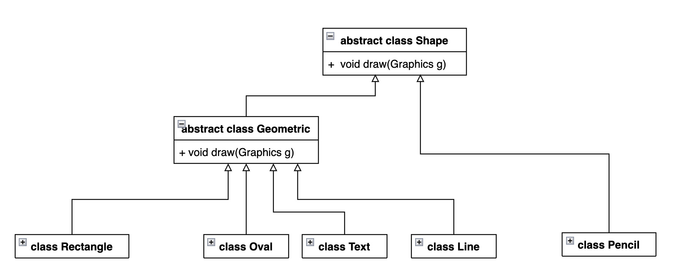

# how code works(s-ch)

Please check git log to better understand how code works


### MVC

 

> MVC model of Jdraw


### View

这里的view仅指在画布上**动态**呈现的图形, 所有画动态图形操作全是在`DrawCanvas.java`中完成的, 更准确的说, 是在一个方法`paintComponent(Graphics g)`中完成的, 在该方法中我们遍历了所有画布上的图形对象(存储在shapeStack中), 并调用了每个对象的`shape.draw()`方法. 具体每个图形执行 `shape.draw()`画出具体的图形(例如矩形, 椭圆, 文字等等)

```java
    // drawCanvas.java
		...
		@Override
    public void paintComponent(Graphics g) {
        super.paintComponent(g);
        Graphics2D g2d = (Graphics2D) g;
        for (Shape shape : shapeStack) {
            g2d.setColor(shape.getColor());
            g2d.setStroke(shape.getStroke());
            shape.draw(g);
        }
		....
```

#### 谁调用了 `paintComponent()` ?

我们不需要(也不能)直接在代码里调用这个方法. 只有2种情况该方法被调用:

1. 包含该方法的JComponent被创建(DrawCanvas)
2. 在其他地方用`repaint()` 间接调用, `repaint()` 方法全部放在`Controller`中, 后续会介绍


关于Swing画图的机制, 可以查看这两篇文章:

 [A Closer Look at the Paint Mechanism](https://docs.oracle.com/javase/tutorial/uiswing/painting/closer.html)

[Who calls paintComponent](http://www.fredosaurus.com/notes-java/GUI-lowlevel/graphics/15who-calls-paintcomponent.html)


### Model

我们在`DrawCanvas.java`中存放了所有图形的具体对象, 但类和方法的定义全部放在`Shape.java`中. 每一个类都通过继承或Override拥有`void draw(Graphics g)` 这个方法, 例如对于Oval来说, 其中调用了Graphics的方法

```java
...
  	// class Rectangle
		@Override
    void draw(Graphics g) {
        g.drawOval(topLeftPoint.x, topLeftPoint.y, width, height);
    }
...
```

  

>  class hierachy in Shape.java


### Controller

controller是整个画图软件最为核心, 也是最难理解的部分. 理论上所有Controller的代码都应该放在一个代码文件中, 但由于还有部分功能没有实现, Controller的代码分为两部分, 一部分存放在`drawCanvas.java`中, 另一部分放在`SideBar.java`中.

#### Listener

Controller的核心就是Listener. 理解listener最好的方法就是通过例子模拟.

##### 用户怎么向Controller传输信号(例如鼠标点击/移动)

用户在按钮1上点击鼠标, 此时如果按钮1上有listener(假设叫`button1Listener`), 那么程序会立即执行`button1Listener`中的方法`mousePressed()`, 这样就实现了特定事件信号的传输.

需要注意的是一个Listener可以监听多个对象(例如Button1, Button2, ....)

##### Controller怎么改变Model中的数据

直接在mousePress()中更改数据即可, 不同的事件对应不同的方法.

##### 最终怎么重画?

通过`repaint()`. `repaint()`可以理解为立即执行`drawCanvas.java`中的`paintComponent()`. 


### FAQ

#### 在哪里调用`g.drawLine(...)`这样的方法画画?

`DrawCanvas.java `中的`paintComponent()`负责画出所有图形, 其他所有地方都只应该调用`repaint()`, 让`repaint()`去调用`paintComponent()`


#### 怎么存储所有的图形?

`Shape.java`中定义了所有图形的数据结构, 在`DrawCanvas.java`中我们用一个栈`shapeStack`来存储所有可能被创建的图形.


#### 图形什么时候被创建?

从用户角度来看, 每当鼠标点击一次, 就应该创建一个新的图形. 

`DrawCanvas.java` 中我们添加了 `addMouseListener ->mousePressed() ` . 当鼠标被点击时该方法会自动被调用,   当中包括了创建新图形, 并把它push进`shapeStack`的代码.

 

#### 怎么判断创建图形的类型?

从`SideBar`中获取`ShapeType`.


#### `paintComponent()`中怎么实现每个shape画出对应的形状?

直接调用`shape.draw()` 即可, 因为我们是用interface操作的, 每个图形都overrider了这个方法.


#### 怎么实现图形变化(例如矩形的伸缩)?

`addMouseMotionListener -> mouseDragged()` 更改对应`Shape` 的数据然后`repaint()`


#### 如何实现undo/redo功能?

使用两个栈, 图形栈(`shapeStack`)存放显示的shape, 垃圾栈(`trashBin`) 存放不要的图形. 当undo时把图形栈顶端的shape压入垃圾栈, redo则反过来做.


#### 为什么要在TextPanel.java中单独创造一个subclass FontInfo? Java不是已经有自带的class Font吗?

class Font只能获取它的属性, 而不能单独设置其中的一个属性(例如 `myFont.setName("Serif")` 这种方法是没有的). 而且大多数时候Font都被用做Anonymous class, 例如 `myComponent.setFont(new Font("Serif", Font.BOLD, 12))`. 为此我们只能在TextPanel.java中创建一个类似struct的数据结构来存储这些Font相关的信息.


#### TextPanel相关

怎么改变Text内容? JTextField

字体大小/字体?  使用JComboBox


#### 点击TextPanel.java 中的按钮, 怎么改变drawCanvas.java 中的对应属性?

[How to propogate Swing events from a inner component to a container?](https://stackoverflow.com/questions/2191060/how-to-propogate-swing-events-from-a-inner-component-to-a-container)

有3种思路,

思路1: 在TextPanel (inner component) 中自己fire一个event 

思路2 :在drawCanvas (顶层) 中获取TextPanel.getTextButton(), 并为其设置listener. 

思路3: 在含有Component那层中递归向上找对应的Container

我们采用了思路3, 因为这样代码的可读性更好, 原则是: 需要在哪里改数据, 就在哪个文件添加Listener, 不管添加listener的component在哪个文件中

例子

```java
		//drawCanvas.java
		...
				DrawFrame drawFrame = (DrawFrame) SwingUtilities.getWindowAncestor(this);
        JButton redoButton = drawFrame.sideBar.redoButton;
        JButton undoButton = drawFrame.sideBar.undoButton;
    ...
```


#### 改变 textField 时画出来的Text就不同, 不用再点击Text按钮

使用`DocumentListener()`, 看这篇文章:[Value Change Listener to JTextField](https://stackoverflow.com/questions/3953208/value-change-listener-to-jtextfield)

#### 选择状态(点击了选择按钮后), 在canvas中拖动鼠标能移动图形(如果有多个图形重叠选最新画的)

遍历栈, 退出循环后就是栈最上面的那个shape(如果没有则返回null)

#### color stroke 怎么改变上一个选择图形(如果有的话) 的属性?

todo


### todo

- [x] 画出各种图形
- [x] 添加 `Sidebar`(先用Text描述即可, 后续替换成Icon)
- [x] 调整颜色(包括取色框), 仅改变下一个画出来的图形颜色, 如果要改已经画出来的图形颜色会比较复杂
- [x] 画出文字
- [ ] 橡皮擦
- [x] 图形线条粗细/橡皮擦大小
- [ ] 打开图片
- [ ] 保存图片
- [x] 撤销/恢复 undo / redo
- [x] 移动画出来的对象(当按下选择按钮后)
- [ ] 根据选择(移动)对象更新 color 和 stroke
- [ ] 撤销/恢复 移动行为
- [ ] 放大/缩小
- [ ] 填充(包括创建图形时的默认填充选项, JCheckBox)
- [ ] 将 Button 替换成 Image Icon


### Reference

[Java GUI: about getContentPane( ) method and content](https://stackoverflow.com/questions/16744152/java-gui-about-getcontentpane-method-and-content)

[How do you format code in Visual Studio Code (VSCode)?](https://stackoverflow.com/questions/29973357/how-do-you-format-code-in-visual-studio-code-vscode)

[repaint() method in JFrame or Jpanel?](https://stackoverflow.com/questions/36368485/repaint-method-in-jframe-or-jpanel)

[What does super.paintComponent(g) do?](https://stackoverflow.com/questions/28724609/what-does-super-paintcomponentg-do)

[who calls paintComponent()](http://www.fredosaurus.com/notes-java/GUI-lowlevel/graphics/15who-calls-paintcomponent.html)

[How to get the name of a class without the package?](https://stackoverflow.com/questions/2690333/how-to-get-the-name-of-a-class-without-the-package)

[Java swing draw rectangle in mouse drag and drop](https://stackoverflow.com/questions/40945461/java-swing-draw-rectangle-in-mouse-drag-and-drop)

[color chooser](https://docs.oracle.com/javase/tutorial/uiswing/components/colorchooser.html)

[How to display a color selector when clicking a button?](https://stackoverflow.com/questions/26565166/how-to-display-a-color-selector-when-clicking-a-button)

[Draw text with graphics object on JFrame](https://stackoverflow.com/questions/8802320/draw-text-with-graphics-object-on-jframe)

[Set text size of JComboBox in Swing](https://stackoverflow.com/questions/18704022/set-text-size-of-jcombobox-in-swing)

[When to use static methods](https://stackoverflow.com/questions/2671496/when-to-use-static-methods)

[How to Change Font Size in drawString Java](https://stackoverflow.com/questions/18249592/how-to-change-font-size-in-drawstring-java)


